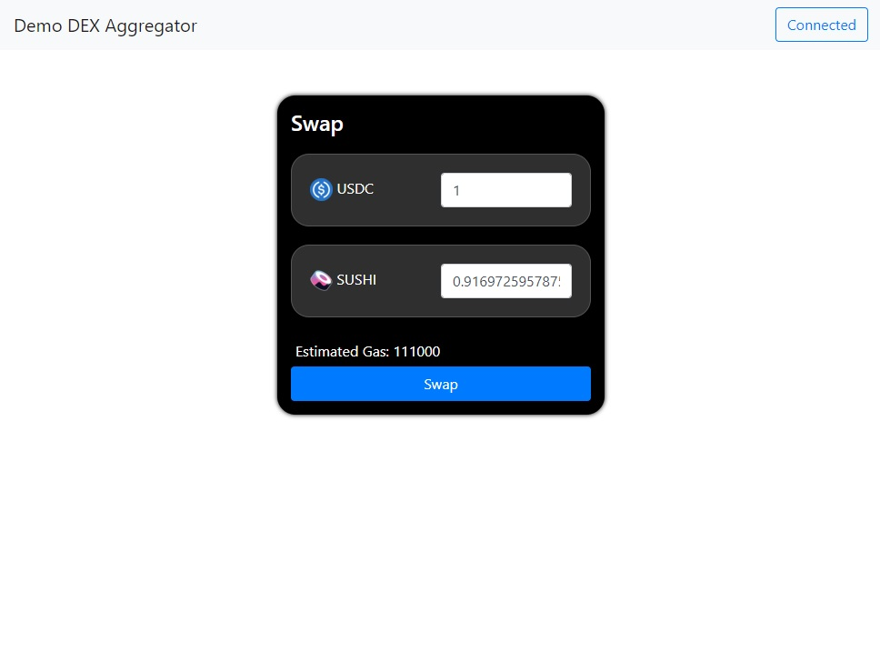

# Alchemy Road to Web3 Week 9

<a href="https://www.youtube.com/watch?v=tVvZ1ivp4X0">Tutorial on youtube</a>
<a href="https://docs.alchemy.com/docs/how-to-build-a-token-swap-dapp-with-0x-api">Written tutorial version</a>

## Getting started

```bash 

git clone https://github.com/AnastasiaMenshikova/alchemy-week-9

cd alchemy-week-9

yarn install

```

To run development server you'll need `Live Server`.

## Example

<p float="left">
    
</p>